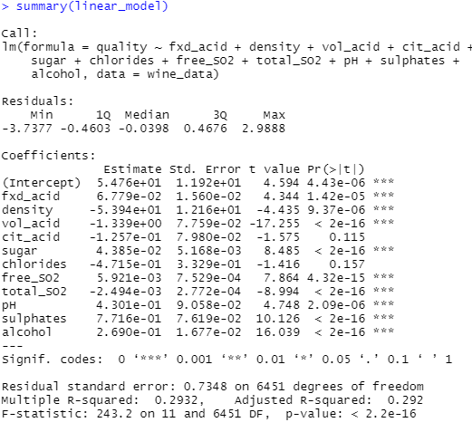
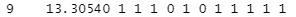

# Wine Quality Analysis

## Overview of Project
The purpose of this analysis is to figure out which independent variables in the dataset that can be use to predict the quality of a bottle of wine. Mulitple linear regreesion will be used for this analysis.

Multiple linear regression is a statistical model that uses not only one but multiple independent variables to predict the outcome of the dependent variable. We will then see whether each independent variable has a significant relationship with the dependent variable. The R-squared value of the model will also be considered to see how much variability of the dependent varibale is accounted by the independent variables. 

The best subset technique will also be implemented to choose the best subset of predictors determined by the Cp value. Cp is used instead of R-squared value as we know that the R-squared value increases as number of independent variables increase. This means that if we choose the best subset of predictors based on R-squared, we will tend to choose models with the highest number of predictors. This is not ideal as we are trying to find the best subset of predictors that best predicts the dependent variable.

## Results
### Mulitple linear regression model

Looking at the multiple regression results, we can see that not all of the predictors have significant relationship with the dependent variable. Based on this model we see that Citric acid and chlorides in wine do not have significant impact on wine quality while fixed acidity, volatile acidity, residual sugar, free sulphur dioxide, total sulphur dioxide, density, pH, sulphates, and alcohol all have significant impact on wine quality. We can also see that the intercept is statistically significant which means that the intercept term explains a significant amount of variability in the dependent variables when all the predictors are zero. However, a statistically significant intercept can also mean that the significant predictors may need scaling or transformation to help improve the predictive power of the model.

### Best subset technique
As mentioned, the best subset technique is used to identify the best subset of predictors for quality of wine. The results of this analysis shows that the best predictors based on the Cp value of the subset of predictors are fixed acidity, density, volatile acidity, sugar, free sulphur dioxide, total sulphur dioxide, density, pH, sulphates, and alcohol. The results are shown in the screenshot below.

## Summary
From our results, we can say that the best predictors of quality of wine are fixed acidity, density, volatile acidity, sugar, free sulphur dioxide, total sulphur dioxide, density, pH, sulphates, and alcohol. Subsequenlty, the best model with the best Cp value also uses these predictors.
